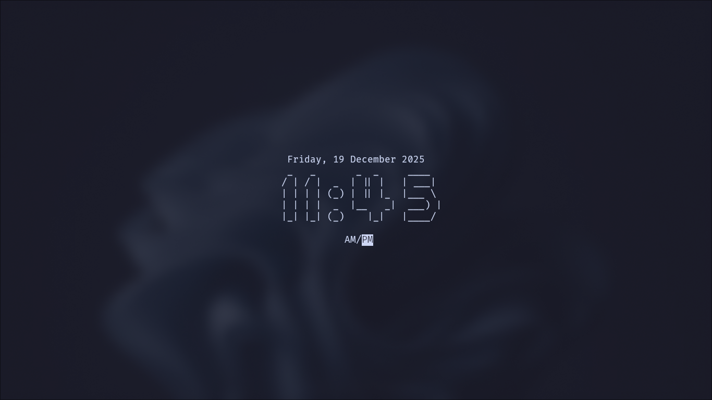

# clockt

A digital clock that runs in your terminal.  

## Features
User preference
- You can select the clock format
- There's 2 options you can configure
- Set it within program's flag! (see: Flags)

## Flags
**time**  
* -t12    set time to 12-hours format
* -t24    set time to 24-hours format

**display**  
* -dHM    displaying hour:minute format
* -dHMS   displaying hour:minute:second format
